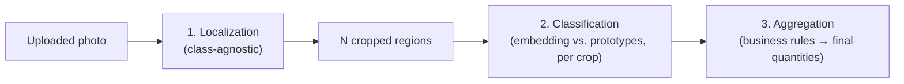

# 🤖 AI Recognition

> [!NOTE]
> This is the technical core of the project. Some parts of this document are **finalized decisions**, others are **open questions marked TBD** — flagged clearly so we solve them together before writing the recognition code.

---

## ✅ Chosen approach: two-stage — localize, then classify each instance

Recognition is **not** one embedding call per photo. It's two separate steps, because a single crate photo can contain multiple items, possibly of different products (see [Counting & business rules](#-counting--business-rules) below):

1. **Localization (class-agnostic):** find every distinct item/slice region in the photo — *where* things are, without needing to know *what* they are. This step is never trained on our specific products, so adding a new product never touches it.
2. **Classification (per instance):** crop out each located region and run it through the same **embedding + prototype similarity matching** used for the whole-product case — *what* each located item is.

### Why embeddings for the classification step

1. Every reference photo is run through an embedding model, which turns the image into a fixed-length numeric vector — a compact "fingerprint" of what's visually in it.
2. For each product, the embedding vectors of its reference photos are combined into one or more **prototype vectors**.
3. To classify a cropped region, its embedding is compared (cosine similarity) against every stored prototype. The closest match wins, with a confidence score = how close the match was.

**Why this fits the project's constraint:** once a photo's (or crop's) embedding has been extracted, the raw image is no longer needed — it can be deleted immediately, only the small vector stays. Process, learn, discard.

---

## 🎓 Training pipeline (adding a new product)

Unaffected by the two-stage recognition design — reference photos already show one product per photo (per [How_to_create_photos.md](../Tutorials/How_to_create_photos.md)), so localization isn't needed during training, only during recognition.

1. Manager uploads 5+ reference photos for a new product.
2. Each photo → embedding vector (one API/model call per photo).
3. Vectors are combined into the product's prototype(s) and stored in `ProductPrototype` (see [Data_Model.md](./Data_Model.md)).
4. Raw photo is deleted immediately. **Exception:** photos explicitly marked for the persisted test set are kept instead (see [Test_Plan.md](../Testing/Test_Plan.md)) — a manual/explicit flag at upload time, not automatic.

### 🧭 One vs. multiple prototypes per product — open decision

- **Single averaged prototype:** simplest, one vector per product. Risk: averaging photos taken from very different angles/lighting can blur the "fingerprint" and hurt accuracy.
- **Multiple prototypes per product** (e.g., keep each reference photo's vector, or cluster them): more robust to angle/lighting variation, matching becomes "closest of any prototype across all products" instead of "closest of N averaged prototypes." Slightly more storage, no real extra complexity.

**Leaning toward multiple prototypes per product** given the tutorial already asks for 5 photos from deliberately different angles — averaging them away seems wasteful. Final call: TBD when we design the matching code.

---

## 🔍 Recognition pipeline (during delivery)

1. Driver's photo is uploaded, tied to the active `DeliverySession`.
2. **Localization step** finds every distinct item/slice region in the photo (see [Open technical decision: localization](#-open-technical-decision-localization-model) below).
3. For **each** located region: crop → embedding → cosine similarity against all stored prototypes → best match + confidence.
4. **Confidence threshold** (per region):
   - Above threshold → region is labeled with the matched product.
   - Below threshold → region is flagged "unknown" — driver resolves it manually (pick from the product list, or mark as not-a-product / discard if the localizer picked up something irrelevant).
5. **Aggregation** turns the per-region results into final `DeliveryNoteItem` rows — see business rules below. This is where "16 regions found" becomes "1× celá torta" or "7× maková + 7× malinová" depending on what those regions actually classified as.
6. Driver reviews the aggregated result on screen and can correct anything before confirming — corrections adjust individual region labels, which re-runs aggregation, not free-text quantity entry from scratch.
7. Photo (and all crops) deleted immediately after step 3 completes for every region — nothing is kept, matched or not.
8. Each resulting `DeliveryNoteItem` keeps `aiConfidence` (from its contributing region(s)) and `wasManuallyCorrected`, so accuracy can be reviewed later (see [Test_Plan.md](../Testing/Test_Plan.md)).

**Exact threshold value** is a tuning parameter, not a design decision — set empirically once real prototypes and test images exist.

---

## 🔢 Counting & business rules

Two different real-world unit types exist, confirmed against how the bakery actually sells things — this is domain logic layered **on top of** the detection results, not a CV concern by itself:

| `Product.unitType` | Examples | Counting rule |
|---|---|---|
| `piece` | venček, špic, punčík | Every located-and-classified instance = 1 unit of whatever it was classified as. A crate can freely mix multiple `piece` products — each instance is counted under its own product. |
| `whole` | celé torty | The photographed cake is still localized/classified **per visible slice** (same pipeline, no special case in steps 1–3). **Aggregation rule:** if all slices of one photographed cake classify as the same product → collapse to **1 unit** of that product (a whole cake, regardless of how many slices it was pre-cut into). If slices disagree (e.g. one physical cake is genuinely half poppyseed / half raspberry) → **do not collapse** — count units per product = number of slices classified as that product (e.g. 7× maková, 7× malinová). |

This means the "1 whole cake" outcome is a **rollup performed after per-slice classification**, not a separate, simpler code path — the same pipeline handles a plain single-flavor cake and a half-and-half cake correctly without extra branching logic, other than the collapse-if-uniform check.

`Product.unitType` needs to be set once per product when it's created (see [Data_Model.md](./Data_Model.md)) — it's a catalog property (torta vs. drobný kúsok), not something the AI infers per photo.

---

## ✅ Resolved: localization — Gemini bounding-box detection

**Decided 2026-08-24**, same day as the embedding decision — turned out to be the same vendor. Gemini's vision model returns bounding boxes via a prompted JSON request (`box_2d: [ymin,xmin,ymax,xmax]` normalized 0-1000, well-documented Gemini capability). Implemented in [`server/src/services/localization.js`](../../server/src/services/localization.js), model `gemini-flash-latest`.

**Why this won over SAM/classical CV:** same `GEMINI_API_KEY` already in use for embeddings — one vendor for the whole AI layer instead of three separate moving parts. No new account, no local CV tuning against lighting/background conditions we hadn't tested yet.

**Verified empirically before committing**, on two synthetic test photos (generated with Gemini image-gen, since no real bakery photos exist yet):
- A crate with 3 ring pastries + 1 cake → found exactly 4 well-separated boxes, correctly labeled.
- A cake sliced into 8 wedges, 4 poppyseed / 4 raspberry → found all 8 slices as separate regions, split evenly by topping.

**Full pipeline tested end-to-end** (localize → crop each region via `sharp` → embed each crop → classify → aggregate per the counting rules below):
- Crate photo (3 venčeky + 1 torta, trained on crops from the same synthetic photo) → correctly aggregated to **3× Venček, 1× Čokoládová torta**, confidence 0.96–0.98.
- Split-cake photo (trained "Maková torta" / "Malinová torta" as separate products) → correctly aggregated to **4× Maková torta, 4× Malinová torta** — the exact scenario these counting rules were designed around, verified not to collapse into one unit.

**Known limitation:** ~20 seconds for a 4-item photo (one localization call + one embedding call per detected region, run sequentially). Fine for a demo/defense; worth parallelizing the per-region embedding calls (`Promise.all`) before real-world use if a 20-crate delivery would otherwise take minutes.

**Caveat on all of the above:** every test so far uses Gemini-*generated* synthetic photos, not real bakery photos from the Samsung J5. Accuracy on real reference photos (worse lighting, real camera optics, actual product variation) is still unverified — this needs re-testing once real photos exist, per [How_to_create_photos.md](../Tutorials/How_to_create_photos.md).

## ✅ Resolved: embedding model — Gemini multimodal embeddings

**Decided 2026-08-24.** Using `gemini-embedding-2` (Gemini API, `POST /v1beta/models/gemini-embedding-2:embedContent`) directly on the image bytes — no captioning step, no separate model to host. Implemented in [`server/src/services/embeddings.js`](../../server/src/services/embeddings.js).

**Why this won over the other candidates:**
- **Free tier**, and Adam already has a Gemini API key (used earlier for the wireframe mockups) — no new account, no cost, matching the "free" constraint over a paid hosted API.
- **No second runtime** — it's an HTTP call from the existing Node.js backend, same shape as every other external API call in this project (SuperFaktúra included). No Python microservice needed, unlike the local-model option.
- Genuinely multimodal — accepts image bytes directly (PNG/JPEG), 3072-dimension output.

**Verified empirically before committing** (not just docs/marketing claims): sent two wireframe screenshots through it — identical image twice → cosine similarity `1.0000` (deterministic); two different screens → `0.70` (meaningfully different, not degenerate). Real vectors are ~39KB as JSON in `product_prototypes.embedding_vector`, vs. the old 32-value stub.

**Known constraint:** only PNG and JPEG accepted — HEIC (iPhone's default photo format) would be rejected. Not an issue for the Samsung J5 (Android defaults to JPEG), but worth remembering if the phone ever changes. The upload endpoint returns a clear 422 error naming the failed file rather than crashing if this happens.

---

## 🗑️ Image lifecycle summary

| Image | Stored? | Deleted when |
|---|---|---|
| Reference/training photo | Temporarily, during upload only | Immediately after its embedding is extracted |
| Delivery/recognition photo | Temporarily, during upload only | Immediately after every located region's embedding is extracted |
| Cropped regions (intermediate) | In memory only, never written to disk/storage | Immediately after classification, same request |
| Test-set photo | **Yes, persisted** | Never (explicitly excluded from the auto-delete rule) — see [Test_Plan.md](../Testing/Test_Plan.md) |
