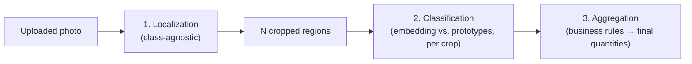

# 🤖 AI Recognition

> [!NOTE]
> This is the technical core of the project. Some parts of this document are **finalized decisions**, others are **open questions marked TBD** — flagged clearly so we solve them together before writing the recognition code.

---

## ✅ Chosen approach: two-stage — localize, then classify each instance

Recognition is **not** one embedding call per photo. It's two separate steps, because a single crate photo can contain multiple items, possibly of different products (see [Counting & business rules](#-counting--business-rules) below):

1. **Localization (class-agnostic):** find every distinct item/slice region in the photo — *where* things are, without needing to know *what* they are. This step is never trained on our specific products, so adding a new product never touches it.
2. **Classification (per instance):** crop out each located region and run it through the same **embedding + prototype similarity matching** used for the whole-product case — *what* each located item is.

### Why embeddings for the classification step

1. Every reference photo is run through an embedding model, which turns the image into a fixed-length numeric vector — a compact "fingerprint" of what's visually in it.
2. For each product, the embedding vectors of its reference photos are combined into one or more **prototype vectors**.
3. To classify a cropped region, its embedding is compared (cosine similarity) against every stored prototype. The closest match wins, with a confidence score = how close the match was.

**Why this fits the project's constraint:** once a photo's (or crop's) embedding has been extracted, the raw image is no longer needed — it can be deleted immediately, only the small vector stays. Process, learn, discard.

---

## 🎓 Training pipeline (adding a new product)

Unaffected by the two-stage recognition design — reference photos already show one product per photo (per [How_to_create_photos.md](../Tutorials/How_to_create_photos.md)), so localization isn't needed during training, only during recognition.

1. Manager uploads 5+ reference photos for a new product.
2. Each photo → embedding vector (one API/model call per photo).
3. Vectors are combined into the product's prototype(s) and stored in `ProductPrototype` (see [Data_Model.md](./Data_Model.md)).
4. Raw photo is deleted immediately. **Exception:** photos explicitly marked for the persisted test set are kept instead (see [Test_Plan.md](../Testing/Test_Plan.md)) — a manual/explicit flag at upload time, not automatic.

### 🧭 One vs. multiple prototypes per product — open decision

- **Single averaged prototype:** simplest, one vector per product. Risk: averaging photos taken from very different angles/lighting can blur the "fingerprint" and hurt accuracy.
- **Multiple prototypes per product** (e.g., keep each reference photo's vector, or cluster them): more robust to angle/lighting variation, matching becomes "closest of any prototype across all products" instead of "closest of N averaged prototypes." Slightly more storage, no real extra complexity.

**Leaning toward multiple prototypes per product** given the tutorial already asks for 5 photos from deliberately different angles — averaging them away seems wasteful. Final call: TBD when we design the matching code.

---

## 🔍 Recognition pipeline (during delivery)

1. Driver's photo is uploaded, tied to the active `DeliverySession`.
2. **Localization step** finds every distinct item/slice region in the photo (see [Open technical decision: localization](#-open-technical-decision-localization-model) below).
3. For **each** located region: crop → embedding → cosine similarity against all stored prototypes → best match + confidence.
4. **Confidence threshold** (per region):
   - Above threshold → region is labeled with the matched product.
   - Below threshold → region is flagged "unknown" — driver resolves it manually (pick from the product list, or mark as not-a-product / discard if the localizer picked up something irrelevant).
5. **Aggregation** turns the per-region results into final `DeliveryNoteItem` rows — see business rules below. This is where "16 regions found" becomes "1× celá torta" or "7× maková + 7× malinová" depending on what those regions actually classified as.
6. Driver reviews the aggregated result on screen and can correct anything before confirming — corrections adjust individual region labels, which re-runs aggregation, not free-text quantity entry from scratch.
7. Photo (and all crops) deleted immediately after step 3 completes for every region — nothing is kept, matched or not.
8. Each resulting `DeliveryNoteItem` keeps `aiConfidence` (from its contributing region(s)) and `wasManuallyCorrected`, so accuracy can be reviewed later (see [Test_Plan.md](../Testing/Test_Plan.md)).

**Exact threshold value** is a tuning parameter, not a design decision — set empirically once real prototypes and test images exist.

---

## 🔢 Counting & business rules

Two different real-world unit types exist, confirmed against how the bakery actually sells things — this is domain logic layered **on top of** the detection results, not a CV concern by itself:

| `Product.unitType` | Examples | Counting rule |
|---|---|---|
| `piece` | venček, špic, punčík | Every located-and-classified instance = 1 unit of whatever it was classified as. A crate can freely mix multiple `piece` products — each instance is counted under its own product. |
| `whole` | celé torty | The photographed cake is still localized/classified **per visible slice** (same pipeline, no special case in steps 1–3). **Aggregation rule:** if all slices of one photographed cake classify as the same product → collapse to **1 unit** of that product (a whole cake, regardless of how many slices it was pre-cut into). If slices disagree (e.g. one physical cake is genuinely half poppyseed / half raspberry) → **do not collapse** — count units per product = number of slices classified as that product (e.g. 7× maková, 7× malinová). |

This means the "1 whole cake" outcome is a **rollup performed after per-slice classification**, not a separate, simpler code path — the same pipeline handles a plain single-flavor cake and a half-and-half cake correctly without extra branching logic, other than the collapse-if-uniform check.

`Product.unitType` needs to be set once per product when it's created (see [Data_Model.md](./Data_Model.md)) — it's a catalog property (torta vs. drobný kúsok), not something the AI infers per photo.

---

## 🔓 Open technical decision: localization model

Not chosen yet. This is a new decision introduced by requiring per-instance/per-slice detection instead of one embedding per photo. Realistic candidates:

| Option | How it works | Trade-off |
|---|---|---|
| **Class-agnostic segmentation model** (e.g. Segment Anything / SAM, via a hosted API) | Finds every distinct visual region in an image without needing to know what any of them are — never retrained when a product is added | Most robust to messy real-world crate photos and subtle slice boundaries (cut lines on a cake are a faint visual cue); adds an external API call and cost per photo |
| **Classical image processing** (e.g. contour/blob detection) | No AI model — pure image processing (edges, contours, thresholding) to find distinct regions | Free, fast, no external dependency; only reliable if crate photos have a fairly controlled, plain background and decent lighting (worth prototyping first since the bakery kitchen setup is likely to actually offer that) |

**Recommendation:** prototype the classical approach first against real bakery photos (cheap to try, no API cost) since kitchen crates are likely photographed against a plain, controlled background; fall back to a hosted segmentation model if it's too unreliable on real photos (especially for spotting faint cut lines on a uniformly-glazed cake). Final call: TBD, needs real sample photos to test against.

## 🔓 Open technical decision: which embedding model/API

Not chosen yet — to be decided together before backend coding starts. Realistic candidates:

| Option | How it works | Trade-off |
|---|---|---|
| **Hosted embedding API** (e.g. a CLIP-style model via a hosted inference API) | Backend sends the crop over HTTP, gets a vector back | No local ML infra/GPU needed, simplest to build and defend; depends on an external service + costs per call |
| **Google Cloud Vision — Product Search** | Purpose-built for retail product recognition from reference images | Handles a lot of the matching logic for you; less "our own algorithm" to explain/defend, more vendor lock-in |
| **Local embedding model** (e.g. a small CLIP model run in a Python service) | Runs on our own machine, no external dependency, no per-call cost | Needs a Python microservice next to the Node.js backend, more moving parts, CPU inference is fine for a demo but not fast |

Given the backend is Node.js/Express (see [System_Overview.md](./System_Overview.md)), a **hosted embedding API called over HTTP** is the path of least friction — it avoids needing a second language/runtime just for this one step. Final choice still open, and worth picking together with the localization model since some providers (e.g. a single hosted vision API) might cover both steps.

---

## 🗑️ Image lifecycle summary

| Image | Stored? | Deleted when |
|---|---|---|
| Reference/training photo | Temporarily, during upload only | Immediately after its embedding is extracted |
| Delivery/recognition photo | Temporarily, during upload only | Immediately after every located region's embedding is extracted |
| Cropped regions (intermediate) | In memory only, never written to disk/storage | Immediately after classification, same request |
| Test-set photo | **Yes, persisted** | Never (explicitly excluded from the auto-delete rule) — see [Test_Plan.md](../Testing/Test_Plan.md) |
