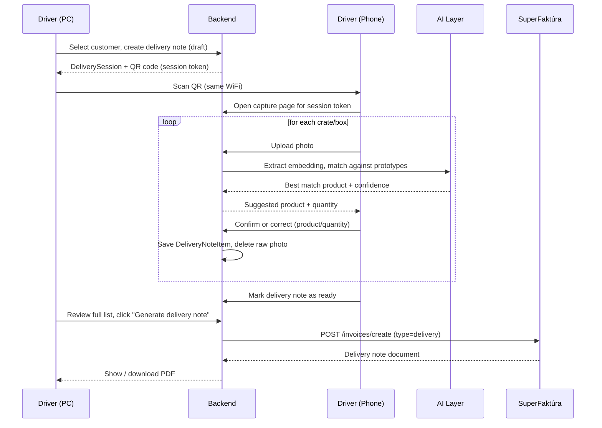
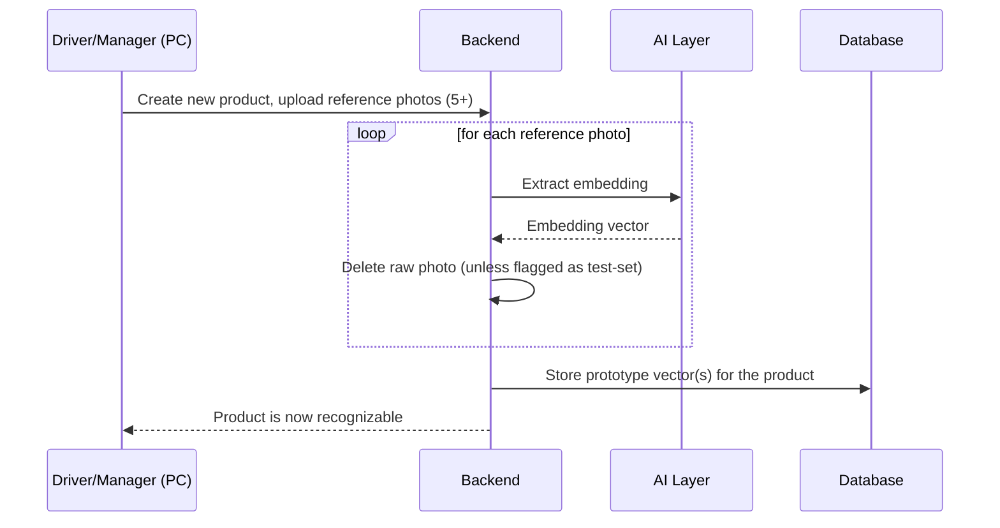

# 🔄 Data Flow

> [!NOTE]
> This document walks through both real-world flows in the system: **(A)** delivering an order to a customer, and **(B)** teaching the AI a new product. See [System_Overview.md](./System_Overview.md) for what each component is, and [Data_Model.md](./Data_Model.md) for the exact records created at each step.

---

## 🚚 A. Creating a delivery (main flow)

### Step by step

1. **Login** — driver logs into the PC dashboard. *(Currently mocked in [LoginPage.jsx](../../packing/src/pages/LoginPage.jsx); real auth via [Login_Auth.jsx](../../packing/src/scripts/Login_Auth.jsx) is planned but not wired in yet.)*
2. **Select customer** — driver opens an existing customer or creates a new one.
3. **Create delivery note** — backend creates a `DeliveryNote` (status `draft`) and a `DeliverySession` (a short-lived token tied to that delivery note).
4. **QR code** — PC dashboard renders a QR code encoding a URL to the capture page, e.g. `http://<pc-local-ip>:<port>/scan/<sessionToken>` (see [Network_Session.md](./Network_Session.md) for why this needs HTTPS even on a local network).
5. **Scan** — driver scans the QR with their phone (same WiFi network). The phone opens the capture page already bound to that session — no login needed on the phone, the session token is the authorization.
6. **Photo capture** — for each crate/box, the driver takes one photo (or several, per the [reference photo guidelines](../Tutorials/How_to_create_photos.md) style — angle depends on what's in the crate).
7. **Upload & recognize** — the photo is uploaded to the backend, which calls the AI layer:
   - The AI layer returns the closest matching product and a confidence score.
   - If confidence is below the threshold, the driver is asked to pick the product manually instead of trusting a guess.
8. **Quantity** — the driver confirms or edits the quantity for that item. *(See the [Counting scope note](./AI_Recognition.md#-counting-strategy--scope-note) in AI_Recognition.md — auto-counting multiple items in one photo is not assumed to be automatic in the first version.)*
9. **Item saved, photo deleted** — a `DeliveryNoteItem` (product, quantity, confidence, was-corrected flag) is saved. The uploaded photo is deleted right after the embedding is extracted — it isn't needed anymore.
10. **Repeat** for every crate until the order is fully packed.
11. **Review** — driver switches back to (or stays on) the dashboard and reviews the full item list and totals.
12. **Generate delivery note** — backend calls SuperFaktúra (`POST /invoices/create`, `type: "delivery"`) with the customer and item list. See [SuperFaktura_Integration.md](./SuperFaktura_Integration.md).
13. **Done** — the generated delivery note (PDF) is shown/downloadable, and the `DeliveryNote` status moves to `invoiced`.

---

## 🧠 B. Teaching the AI a new product (training flow)

1. **Add product** — under *Database / Packages* in the dashboard, driver/manager creates a new product entry (name, category).
2. **Upload reference photos** — following [How_to_create_photos.md](../Tutorials/How_to_create_photos.md) (5+ photos minimum, more for crates of many small items).
3. **Embedding extraction** — each photo is processed individually by the AI layer into an embedding vector.
4. **Prototype storage** — the vector(s) are stored against the product (see [Data_Model.md](./Data_Model.md#productprototype) — averaging vs. keeping multiple prototypes per product is an open decision in [AI_Recognition.md](./AI_Recognition.md)).
5. **Deletion** — the raw photo is deleted immediately after its embedding is extracted. **Exception:** a small, explicitly marked subset is kept as the persisted test set (see [Test_Plan.md](../Testing/Test_Plan.md)) — those are *not* auto-deleted.
6. **Product ready** — the new product now participates in matching during deliveries.
