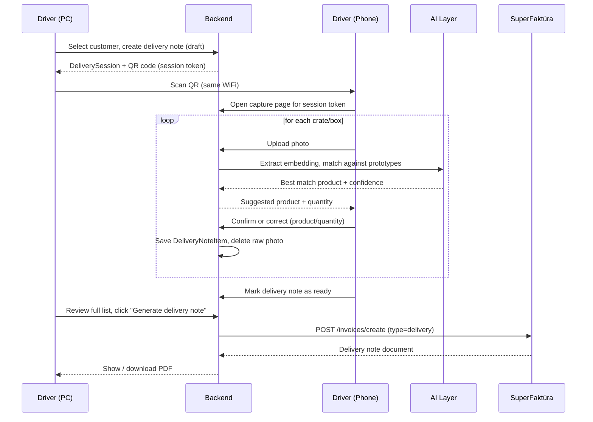
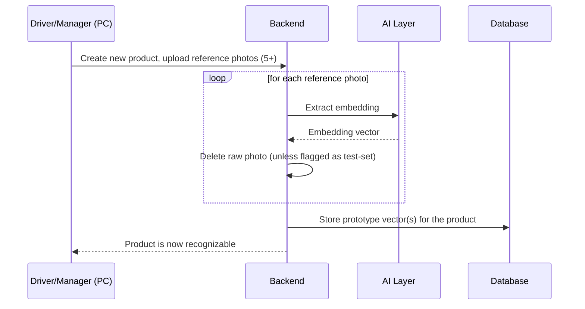

# 🔄 Data Flow

> [!NOTE]
> This document walks through both real-world flows in the system: **(A)** delivering an order to a customer, and **(B)** teaching the AI a new product. See [System_Overview.md](./System_Overview.md) for what each component is, and [Data_Model.md](./Data_Model.md) for the exact records created at each step.

---

## 🚚 A. Creating a delivery (main flow)

### Step by step

1. **Login** — driver logs into the PC dashboard. *(Currently mocked in [LoginPage.jsx](../../packing/src/pages/LoginPage.jsx); real auth via [Login_Auth.jsx](../../packing/src/scripts/Login_Auth.jsx) is planned but not wired in yet.)*
2. **Select customer** — driver opens an existing customer or creates a new one.
3. **Create delivery note** — backend creates a `DeliveryNote` (status `draft`) and a `DeliverySession` (a short-lived token tied to that delivery note).
4. **QR code** — PC dashboard renders a QR code encoding a URL to the capture page, e.g. `http://<pc-local-ip>:<port>/scan/<sessionToken>` (see [Network_Session.md](./Network_Session.md) for why this needs HTTPS even on a local network).
5. **Scan** — driver scans the QR with their phone (same WiFi network). The phone opens the capture page already bound to that session — no login needed on the phone, the session token is the authorization.
6. **Photo capture — two options on the capture page:**
   - **Upload** (primary/recommended): driver photographs all crates first using the phone's normal camera app (fast, no in-browser permission dance), then selects all the resulting photos at once (`<input type="file" multiple>`) and uploads them together — e.g. 20 crates in one batch instead of one round-trip per crate. This path doesn't need a live camera stream in the browser, so it isn't affected by the HTTPS/camera constraint in [Network_Session.md](./Network_Session.md).
   - **Capture** (secondary): take one photo directly in the app via a live camera view, for a single crate at a time — useful when the driver wants to check a tricky item immediately rather than in a batch. This is the path that needs the HTTPS setup.
7. **Upload & recognize** — each uploaded photo (one or many) is processed independently by the backend through the two-stage AI layer (see [AI_Recognition.md](./AI_Recognition.md)):
   - **Localize:** every distinct item/slice in the photo is found.
   - **Classify:** each located item is matched against product prototypes, with its own confidence score.
   - **Aggregate:** results are rolled up into quantities per product — following the [counting & business rules](./AI_Recognition.md#-counting--business-rules) (piece products count per instance; whole cakes collapse to 1 unit unless the slices disagree, in which case they're counted per flavor).
   - Anything below the confidence threshold is flagged for the driver to resolve manually instead of trusting a guess.
   - For a batch upload, photos are processed as they arrive — results appear progressively rather than all at once, so the driver isn't stuck staring at a blank screen for 20 photos.
8. **Confirm** — the driver reviews the already-counted result **while still at the delivery point**, ideally shown as photo thumbnail + result side by side so a wrong match is easy to trace back to the right crate. No typing needed in the normal case — corrections are only for items the AI got wrong.
9. **Item saved, photo deleted** — a `DeliveryNoteItem` (product, quantity, confidence, was-corrected flag) is saved. The uploaded photo is deleted right after the embedding is extracted — it isn't needed anymore.
10. **Repeat** for every crate until the order is fully packed.
11. **Review** — driver switches back to (or stays on) the dashboard and reviews the full item list and totals.
12. **Generate delivery note** — backend calls SuperFaktúra (`POST /invoices/create`, `type: "delivery"`) with the customer and item list. See [SuperFaktura_Integration.md](./SuperFaktura_Integration.md).
13. **Done** — the generated delivery note (PDF) is shown/downloadable, and the `DeliveryNote` status moves to `invoiced`.

### 🧵 Working on several deliveries at once (the pipeline case)

In real use, a driver doesn't sit and wait for one photo batch to finish processing before starting the next customer — they'll upload customer A's crate photos, then go physically prepare customer B's crates while A is being recognized in the background, per the intended workflow. This means at any moment several `DeliveryNote` records can be open in different states (`draft`, `processing`, `ready_for_review`), not just one.

To support this without a delivery note silently getting forgotten:

- The dashboard shows a **queue of open delivery notes** (per customer, with status), not just a single "current" screen.
- A **badge/notification** flags delivery notes sitting in `ready_for_review` — so a driver who moved on to prepare the next order doesn't forget to go back and confirm/generate the previous one before it actually ships.

---

## 🧠 B. Teaching the AI a new product (training flow)

1. **Add product** — under *Database / Packages* in the dashboard, driver/manager creates a new product entry (name, category).
2. **Upload reference photos** — following [How_to_create_photos.md](../Tutorials/How_to_create_photos.md) (5+ photos minimum, more for crates of many small items).
3. **Embedding extraction** — each photo is processed individually by the AI layer into an embedding vector.
4. **Prototype storage** — the vector(s) are stored against the product (see [Data_Model.md](./Data_Model.md#productprototype) — averaging vs. keeping multiple prototypes per product is an open decision in [AI_Recognition.md](./AI_Recognition.md)).
5. **Deletion** — the raw photo is deleted shortly after its embedding is extracted. **Exception:** a small, explicitly marked subset is kept as the persisted test set (see [Test_Plan.md](../Testing/Test_Plan.md)) — those are *not* auto-deleted. See the grace-period note below.
6. **Product ready** — the new product now participates in matching during deliveries.

### ⏳ Grace period before deletion (recommended)

Since [How_to_create_photos.md](../Tutorials/How_to_create_photos.md) will often be followed by production staff without direct supervision (see [Roles_And_Onboarding.md](./Roles_And_Onboarding.md)), a bad batch of reference photos (blurry, wrong product, missed angles) could quietly degrade a product's prototype with no way to notice until deliveries start misidentifying it. Recommended default: keep the raw photos for a short grace period (e.g. 24h) after processing instead of deleting them the instant the embedding is extracted, and show a simple "5/5 photos processed for Venček ✅" confirmation right after upload. This doesn't break the "photos aren't kept" rule in spirit — it's a safety window, not permanent storage — but the exact delay is a tuning choice, not a hard requirement.

---

## 👤 C. Managing driver accounts (manager)

Covered in full in [Roles_And_Onboarding.md](./Roles_And_Onboarding.md) — short version: manager creates a driver account (username + one-time temporary password), hands it over on paper, the driver is forced to set a real password on first login, and if it's later forgotten, the manager issues a new temporary one from the same user list rather than any email-based reset.

---
