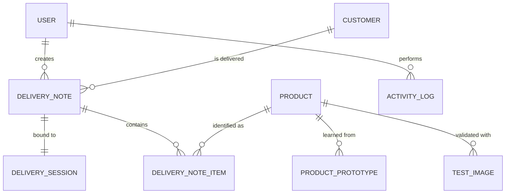

# 🗂️ Data Model

> [!NOTE]
> This describes the entities the backend needs to store and how they relate. Exact column types will be finalized once the database engine is picked (SQLite for dev, see [System_Overview.md](./System_Overview.md)) — this is the conceptual model.

---

## 📊 Entity relationship overview

---

## Entities

### `User`
Driver or manager account. See [Roles_And_Onboarding.md](./Roles_And_Onboarding.md) for the full account lifecycle.

| Field | Type | Notes |
|---|---|---|
| `id` | uuid/int | |
| `username` | string | |
| `passwordHash` | string | real auth, to be built in Phase 1 (see [Roles_And_Onboarding.md](./Roles_And_Onboarding.md)) |
| `role` | string (not a hardcoded 2-value enum) | `driver` \| `manager` today. Stored as a plain string, not a fixed enum type, so a future role (e.g. `production`) can be introduced later without a schema change — only the app's permission checks need updating |
| `mustChangePassword` | bool | `true` when the account was just created or reset by a manager; the app forces a password-change screen before anything else until this is cleared |
| `createdAt` | datetime | |

### `Customer`
| Field | Type | Notes |
|---|---|---|
| `id` | uuid/int | |
| `name` | string | |
| `address` | string | |
| `superfakturaClientId` | int, nullable | filled in once the customer exists on the SuperFaktúra side too |

### `Product`
A recognizable dessert/cake type.

| Field | Type | Notes |
|---|---|---|
| `id` | uuid/int | |
| `name` | string | e.g. "Venček", "Čokoládová torta" |
| `unitType` | enum | `piece` (sold/counted individually — venček, špic, punčík) or `whole` (sold as a whole cake — torty). Drives the counting rollup logic in [AI_Recognition.md](./AI_Recognition.md#-counting--business-rules); set once when the product is created, not inferred per photo |
| `isActive` | bool | can be deactivated instead of deleted |
| `createdAt` | datetime | |

### `ProductPrototype`
The AI's "memory" of a product — what's left after a reference photo is processed and deleted.

| Field | Type | Notes |
|---|---|---|
| `id` | uuid/int | |
| `productId` | FK → Product | |
| `embeddingVector` | float[] | the actual learned representation |
| `sourcePhotoCount` | int | how many reference photos contributed (for display/QA, not the photos themselves) |
| `createdAt` | datetime | |

> Whether a product has **one averaged prototype** or **multiple prototype vectors** (e.g. one per angle-cluster) is an open decision — see [AI_Recognition.md](./AI_Recognition.md).

### `TestImage`
The persisted, never-deleted validation set — separate from training data on purpose.

| Field | Type | Notes |
|---|---|---|
| `id` | uuid/int | |
| `productId` | FK → Product | expected/correct answer |
| `imageRef` | string | path (local disk for now, per the local-storage decision) |
| `embeddingVector` | float[], nullable | cached so re-running tests doesn't require re-computing every time |
| `createdAt` | datetime | |

See [Test_Plan.md](../Testing/Test_Plan.md) for how this is used.

### `DeliverySession`
The short-lived link between the PC (QR generator) and the phone (QR scanner).

| Field | Type | Notes |
|---|---|---|
| `id` | uuid/int | |
| `token` | string | random, unguessable — encoded in the QR URL |
| `deliveryNoteId` | FK → DeliveryNote | |
| `status` | enum | `active` \| `expired` \| `completed` |
| `createdAt` | datetime | |
| `expiresAt` | datetime | short expiry (e.g. 30–60 min), see [Network_Session.md](./Network_Session.md) |

### `DeliveryNote`
One "dodací list" in progress or finished. A driver can have several of these open at once, at different stages — see [the pipeline note in Data_Flow.md](./Data_Flow.md#-a-creating-a-delivery-main-flow), so `status` doubles as what drives the dashboard's queue view.

| Field | Type | Notes |
|---|---|---|
| `id` | uuid/int | |
| `customerId` | FK → Customer | |
| `createdByUserId` | FK → User | |
| `status` | enum | `draft` (photos still being uploaded) → `processing` (AI working through the batch) → `ready_for_review` (needs the driver's confirm/correct pass) → `invoiced` (SuperFaktúra document generated) |
| `superfakturaDocId` | int, nullable | set once SuperFaktúra generates the document |
| `createdAt` | datetime | |

### `DeliveryNoteItem`
One line item — a recognized (or manually picked) product and its quantity.

| Field | Type | Notes |
|---|---|---|
| `id` | uuid/int | |
| `deliveryNoteId` | FK → DeliveryNote | |
| `productId` | FK → Product | |
| `quantity` | int | for `piece` products: count of matching detected instances. For `whole` products: either 1 (uniform cake) or a per-flavor slice count (split cake) — see [counting rules](./AI_Recognition.md#-counting--business-rules) |
| `aiConfidence` | float, nullable | null if entered fully manually; derived from the contributing detected region(s) otherwise |
| `wasManuallyCorrected` | bool | true if the driver overrode the AI's suggestion — useful data for later accuracy analysis |
| `createdAt` | datetime | |

---

### `ActivityLog`
Append-only audit trail — see [Activity_Log.md](./Activity_Log.md) for the full design (what's logged, the timeline UI, filters).

| Field | Type | Notes |
|---|---|---|
| `id` | uuid/int | |
| `userId` | FK → User | who performed the action |
| `userRole` | string (snapshot) | the actor's role **at the time**, not a live reference — stays accurate if their role changes later |
| `action` | string | e.g. `product.created`, `delivery_note.item_corrected` — see the full list in [Activity_Log.md](./Activity_Log.md) |
| `entityType` | string | `Product` \| `DeliveryNote` \| `User` |
| `entityId` | int/uuid | which record this refers to (not a strict FK — the record could theoretically be gone later, the log should still read fine) |
| `summary` | string | precomputed, human-readable line for the timeline, e.g. "Pridaný produkt 'Venček'" |
| `metadata` | JSON, nullable | action-specific detail, e.g. a correction's before/after value |
| `createdAt` | datetime | |

---

## 🗑️ What's deliberately *not* stored

- **Raw training photos** — deleted right after embedding extraction (see [AI_Recognition.md](./AI_Recognition.md)). Only `ProductPrototype.embeddingVector` survives.
- **Raw delivery photos** — same thing. Once a `DeliveryNoteItem` is created, the photo that produced it is gone. `aiConfidence` is kept for traceability instead of the image itself.
