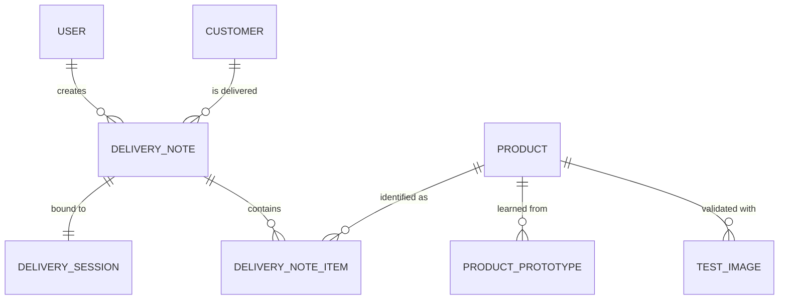

# 🗂️ Data Model

> [!NOTE]
> This describes the entities the backend needs to store and how they relate. Exact column types will be finalized once the database engine is picked (SQLite for dev, see [System_Overview.md](./System_Overview.md)) — this is the conceptual model.

---

## 📊 Entity relationship overview

---

## Entities

### `User`
Driver or manager account.

| Field | Type | Notes |
|---|---|---|
| `id` | uuid/int | |
| `username` | string | |
| `passwordHash` | string | real auth, not yet wired into the app (see [Login_Auth.jsx](../../packing/src/scripts/Login_Auth.jsx)) |
| `role` | enum | `driver` \| `manager` — managers manage products, drivers create deliveries |

### `Customer`
| Field | Type | Notes |
|---|---|---|
| `id` | uuid/int | |
| `name` | string | |
| `address` | string | |
| `superfakturaClientId` | int, nullable | filled in once the customer exists on the SuperFaktúra side too |

### `Product`
A recognizable dessert/cake type.

| Field | Type | Notes |
|---|---|---|
| `id` | uuid/int | |
| `name` | string | e.g. "Venček", "Čokoládová torta" |
| `category` | string, nullable | e.g. single cake vs. small multi-item dessert — relevant for the [counting scope note](./AI_Recognition.md#-counting-strategy--scope-note) |
| `isActive` | bool | can be deactivated instead of deleted |
| `createdAt` | datetime | |

### `ProductPrototype`
The AI's "memory" of a product — what's left after a reference photo is processed and deleted.

| Field | Type | Notes |
|---|---|---|
| `id` | uuid/int | |
| `productId` | FK → Product | |
| `embeddingVector` | float[] | the actual learned representation |
| `sourcePhotoCount` | int | how many reference photos contributed (for display/QA, not the photos themselves) |
| `createdAt` | datetime | |

> Whether a product has **one averaged prototype** or **multiple prototype vectors** (e.g. one per angle-cluster) is an open decision — see [AI_Recognition.md](./AI_Recognition.md).

### `TestImage`
The persisted, never-deleted validation set — separate from training data on purpose.

| Field | Type | Notes |
|---|---|---|
| `id` | uuid/int | |
| `productId` | FK → Product | expected/correct answer |
| `imageRef` | string | path (local disk for now, per the local-storage decision) |
| `embeddingVector` | float[], nullable | cached so re-running tests doesn't require re-computing every time |
| `createdAt` | datetime | |

See [Test_Plan.md](../Testing/Test_Plan.md) for how this is used.

### `DeliverySession`
The short-lived link between the PC (QR generator) and the phone (QR scanner).

| Field | Type | Notes |
|---|---|---|
| `id` | uuid/int | |
| `token` | string | random, unguessable — encoded in the QR URL |
| `deliveryNoteId` | FK → DeliveryNote | |
| `status` | enum | `active` \| `expired` \| `completed` |
| `createdAt` | datetime | |
| `expiresAt` | datetime | short expiry (e.g. 30–60 min), see [Network_Session.md](./Network_Session.md) |

### `DeliveryNote`
One "dodací list" in progress or finished.

| Field | Type | Notes |
|---|---|---|
| `id` | uuid/int | |
| `customerId` | FK → Customer | |
| `createdByUserId` | FK → User | |
| `status` | enum | `draft` \| `ready` \| `invoiced` |
| `superfakturaDocId` | int, nullable | set once SuperFaktúra generates the document |
| `createdAt` | datetime | |

### `DeliveryNoteItem`
One line item — a recognized (or manually picked) product and its quantity.

| Field | Type | Notes |
|---|---|---|
| `id` | uuid/int | |
| `deliveryNoteId` | FK → DeliveryNote | |
| `productId` | FK → Product | |
| `quantity` | int | |
| `aiConfidence` | float, nullable | null if entered fully manually |
| `wasManuallyCorrected` | bool | true if the driver overrode the AI's suggestion — useful data for later accuracy analysis |
| `createdAt` | datetime | |

---

## 🗑️ What's deliberately *not* stored

- **Raw training photos** — deleted right after embedding extraction (see [AI_Recognition.md](./AI_Recognition.md)). Only `ProductPrototype.embeddingVector` survives.
- **Raw delivery photos** — same thing. Once a `DeliveryNoteItem` is created, the photo that produced it is gone. `aiConfidence` is kept for traceability instead of the image itself.
