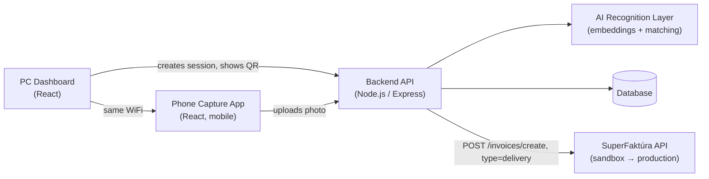

# 🏗️ System Overview

> [!NOTE]
> This document describes the overall architecture of the system: which parts exist, what they are responsible for, and how they talk to each other. For the step-by-step user flow, see [Data_Flow.md](./Data_Flow.md). For the AI recognition design, see [AI_Recognition.md](./AI_Recognition.md).

---

## 🎯 Goal recap

A driver opens a PC dashboard, selects a customer, and starts a delivery note. A QR code hands the session off to the driver's phone, where photos of crates are taken. AI matches each photo against known products and counts them. The finished list is sent to **SuperFaktúra**, which generates the official delivery note (dodací list).

---

## 🧩 Components

| Component | Responsibility | Runs on |
|---|---|---|
| **PC Dashboard** (React/Vite, existing `packing/` app) | Login, customer selection, delivery note creation, QR display, final review, product/prototype management | Driver's PC, same LAN as the backend |
| **Phone Capture App** (same React app, mobile-first routes) | Camera capture bound to a delivery session, shows AI match + confidence, lets the driver confirm/correct | Driver's phone, same WiFi |
| **Backend API** (Node.js / Express) | Auth, sessions, customers, delivery notes, file upload handling, orchestrates the AI layer, talks to SuperFaktúra | Local server (same machine as PC dashboard, or a small local server on the LAN) |
| **AI Recognition Layer** | Turns a photo into an embedding vector and matches it against stored product prototypes | Called by the backend — see [AI_Recognition.md](./AI_Recognition.md) for the exact approach (still being finalized) |
| **Database** | Customers, products, prototype vectors, sessions, delivery notes/items, persisted test set | Same server as the backend (SQLite/Postgres — TBD when coding starts) |
| **SuperFaktúra** | External invoicing service — generates the actual delivery note document | Sandbox now (`sandbox.superfaktura.sk`), production later with a real API key |

---

## 🔀 High-level architecture

---

## 🛠️ Technology stack

| Layer | Choice | Why |
|---|---|---|
| Frontend | React 19 + Vite (already scaffolded in `packing/`) | Already in place, one codebase serves both PC and phone views via responsive routes |
| Backend | Node.js + Express | Same language as the frontend, one stack, easy JSON APIs, easy to call external AI/embedding APIs over HTTP |
| Auth | JWT (groundwork already exists in [Login_Auth.jsx](../../packing/src/scripts/Login_Auth.jsx), not yet wired into the app) | Simple stateless auth for driver/manager accounts |
| Database | SQLite (dev) → Postgres (production, once real deployment is planned) | SQLite needs zero setup for a school project demo; schema is portable to Postgres later |
| AI embeddings | **Open decision** — see [AI_Recognition.md](./AI_Recognition.md) | To be finalized together before coding starts |
| Invoicing | SuperFaktúra REST API (sandbox now, production key later) | Real Slovak invoicing service the client company already/will use |

---

## 🌐 Deployment model (current phase)

- Backend + database run on **one machine** on the local WiFi (the driver's PC, or a small local server).
- The phone reaches the backend over the **local network**, not the public internet.
- This is enough for development and for the maturita defense demo, but has real constraints — see [Network_Session.md](./Network_Session.md) for the HTTPS/camera-permission issue this creates and how it's handled.
- Public hosting (so the system works outside the depot's WiFi) is a future step, not part of the current scope.
